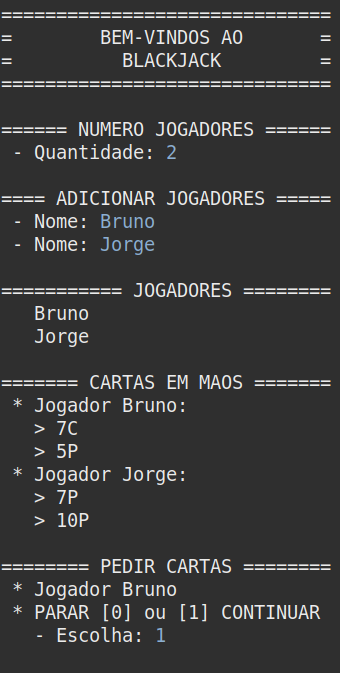
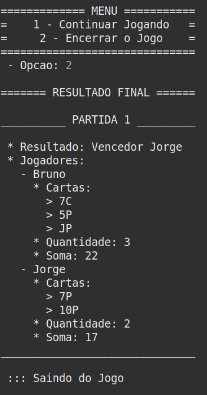

<h1 align="center">
    BlackJack  
    Avaliação 2 de Programação II 
    UESPI - Universidade Estadual do Piauí
</h1>

## 🎭 Blackjack

O objetivo com este projeto é fazer o jogo Blackjack conhecido também como 21, utilizando boas práticas do uso da orientação a objetos. As seguintes informações foram passadas para a construção do projeto:

    a) Deve se utilizar boas práticas de programação da linguagem aprendidas em sala.
    b) Deve ser possível jogar várias partidas.
    c) Ao término de um partida deve-se exibir o resultado do jogo;
    d) Deve ser possível decidir por continuar jogando ou encerrar o jogo.
    e) Após o encerramento do jogo, deve ser apresentado o histórico do jogo com os empates, derretoas, quem venceu, quem perdeu e as pontuações.

## 📁 Projeto
### 📍 Fazendo o clone do repositório:

    git clone https://github.com/brunnuscz/blackjack.git

### 📍 Você pode utilizar a IDE chamada Eclipse para rodar o projeto:

    https://www.eclipse.org/downloads/
    
### 📍 Lembre de instalar o JDK na sua máquina:

    https://www.oracle.com/br/java/technologies/downloads/

## 🚩 Prévia

    
    

